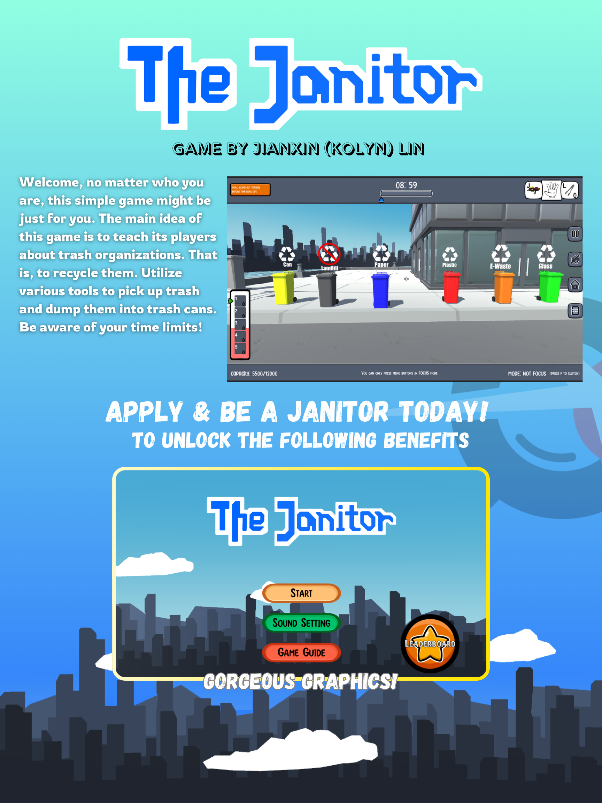
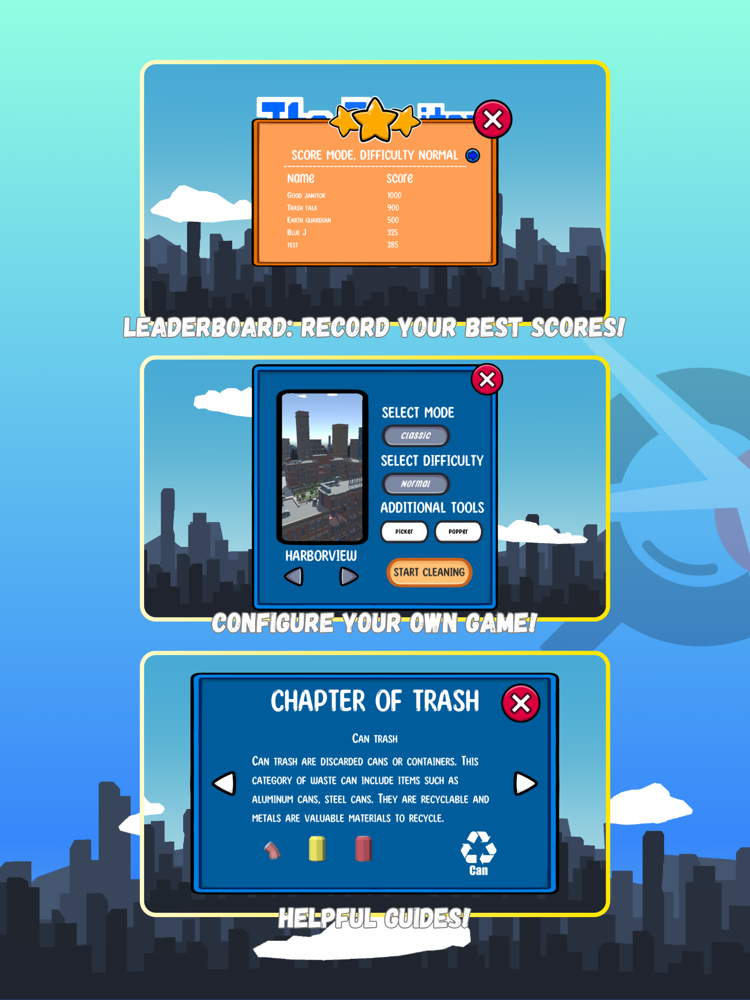
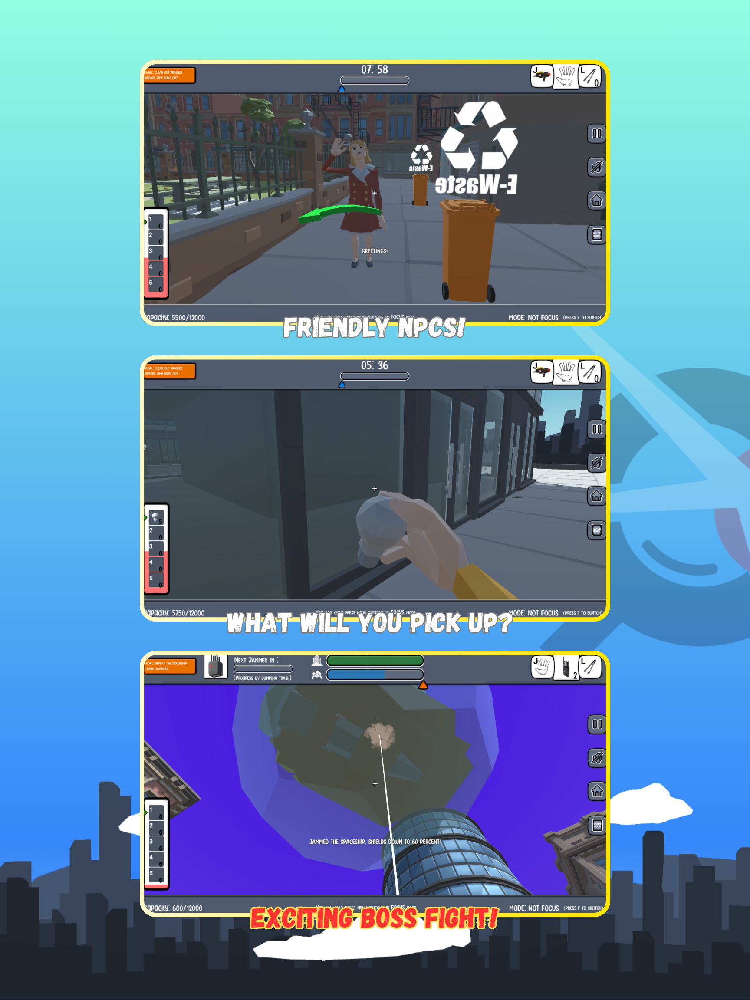
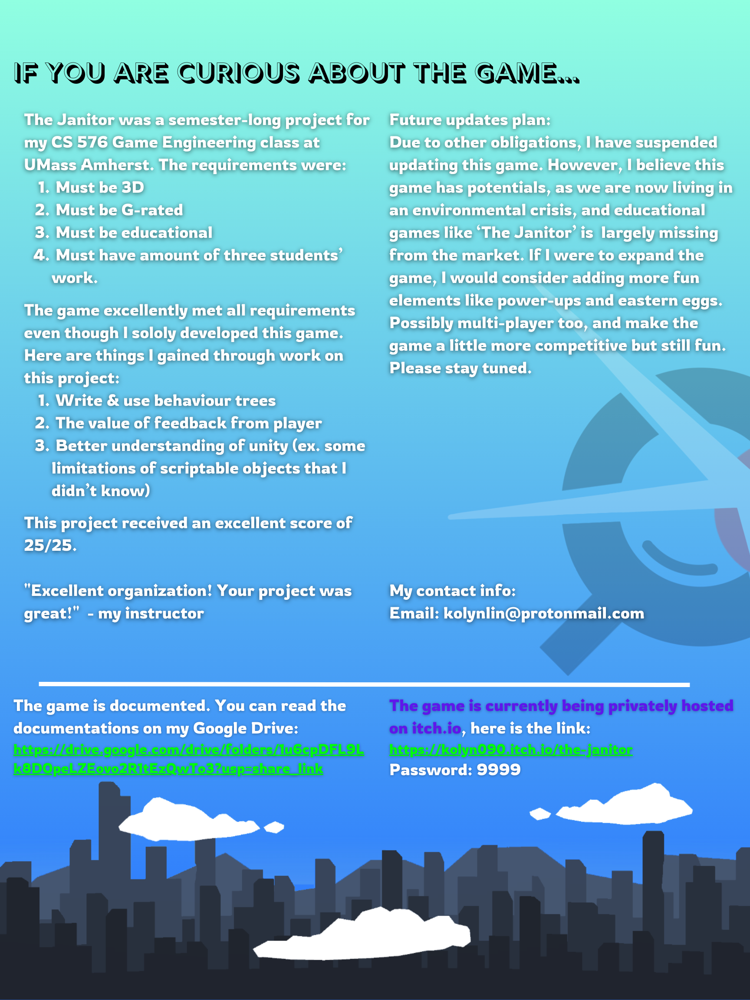

This blog contains a poster about a game I made for my CS576 Game Programming Class. In this game you are a city janitor whos solo responsibility is to keep the city clean. Utilize your favorite tools to eliminate the trash from the streets and keep the environment clean! ♻️♻️♻️

Yes, feel free to grab my idea (would be nice if you credit me too). I no longer have intention to maintain this project. If you think I might be a good fit on your game dev team, you can contact me at `kolynlin@protonmail.com`. I will be very happy to be invited. 🤗

 
 

💗 If you liked this blog, consider [following me on GitHub](https://github.com/Kolyn090/).

 
 

👾 Happy Gaming 👾
