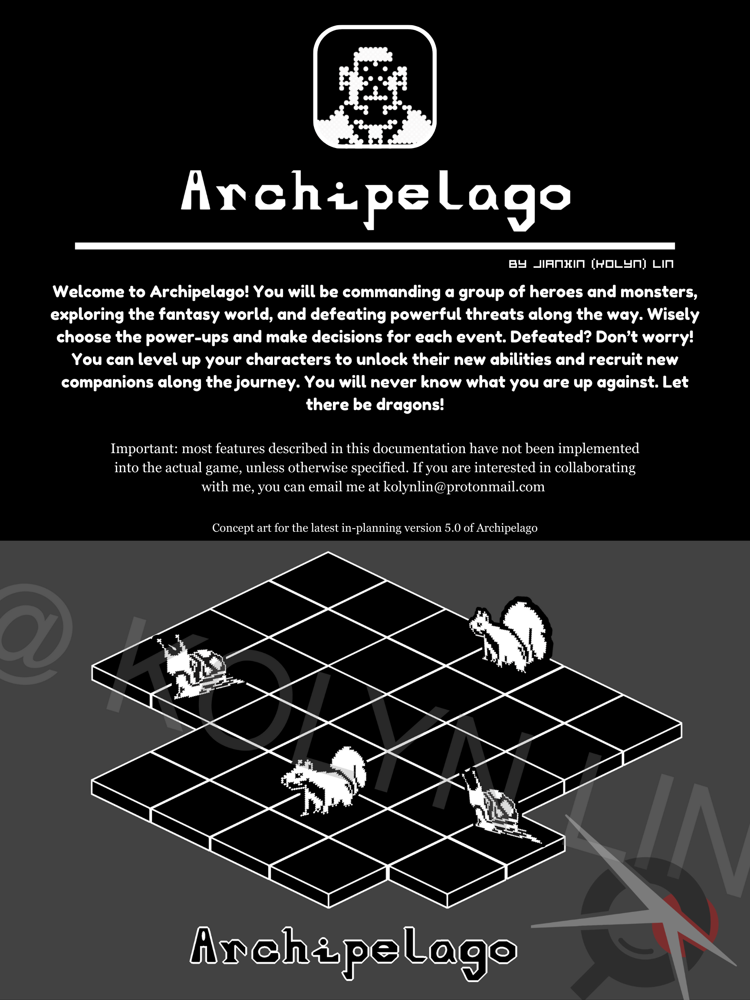
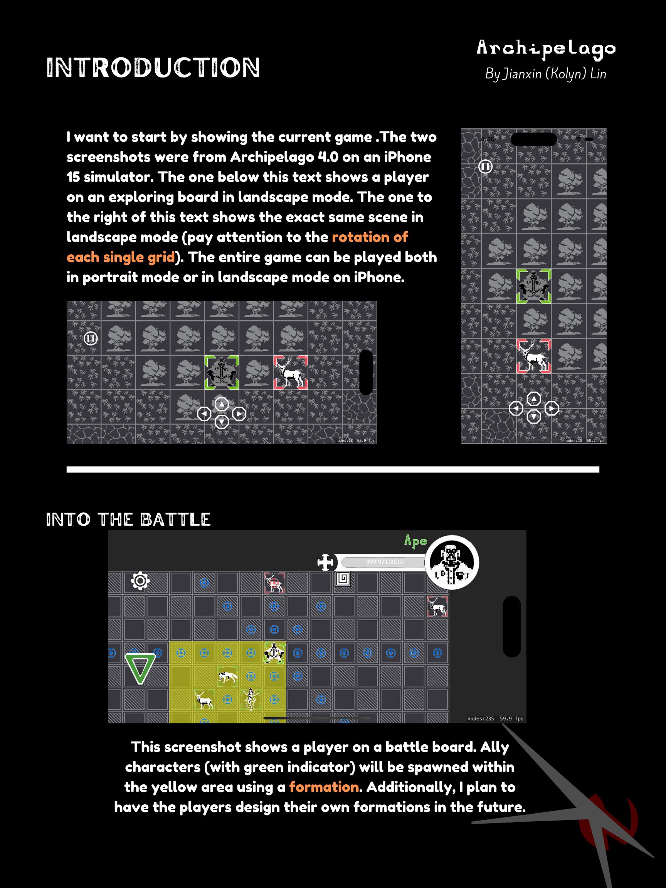
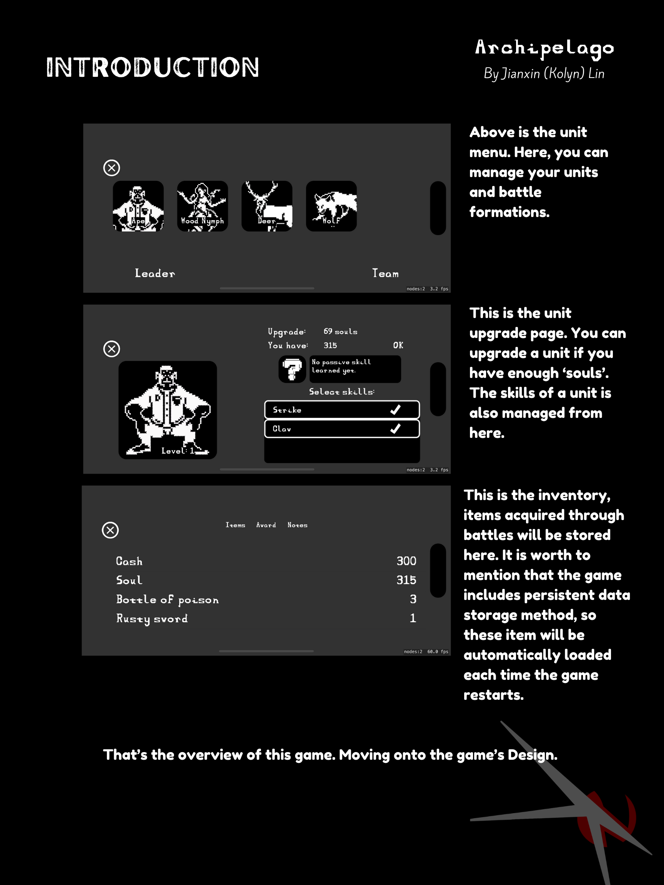
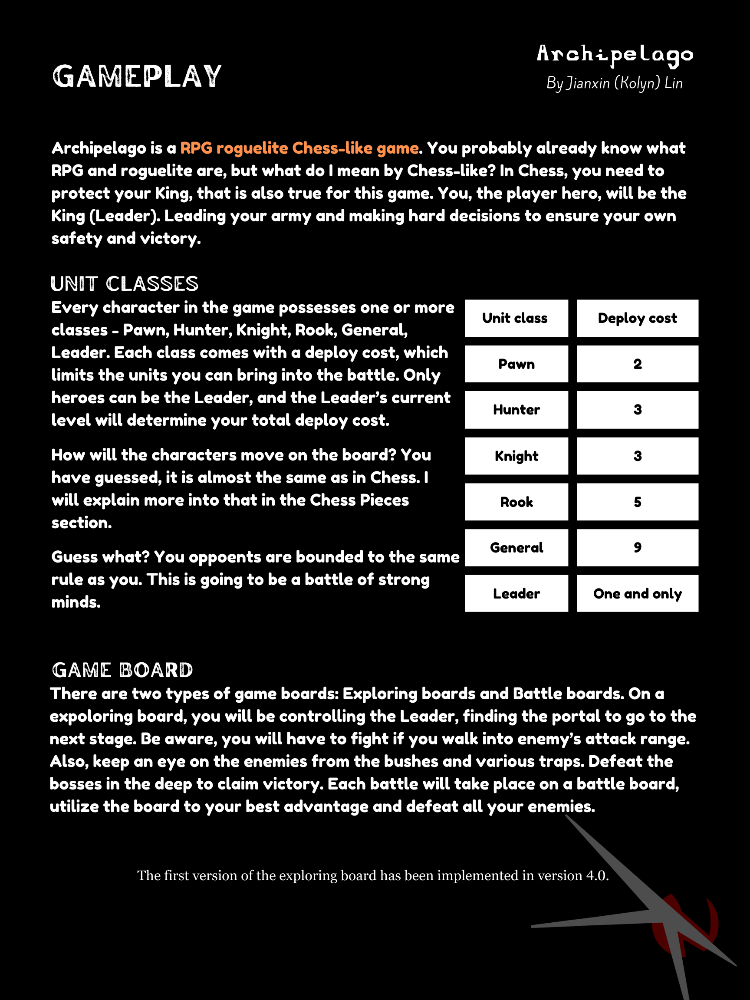
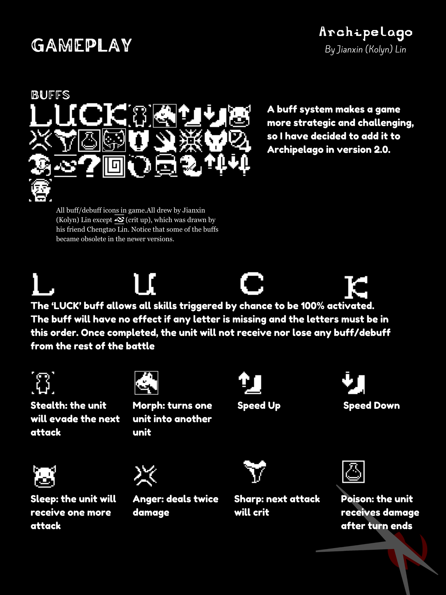
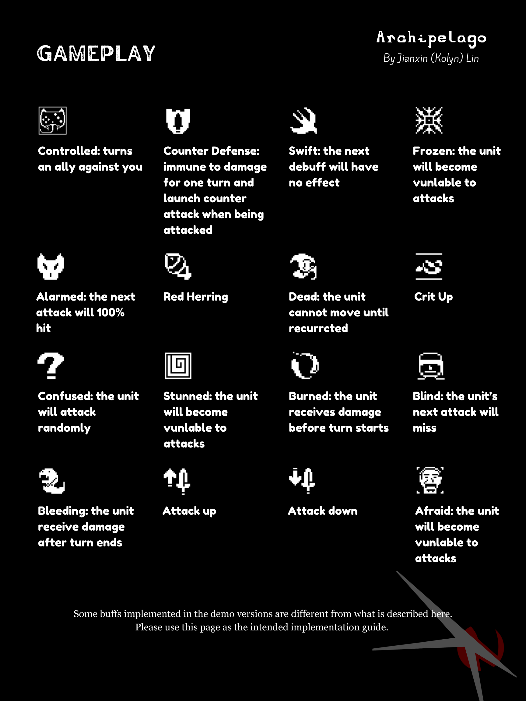
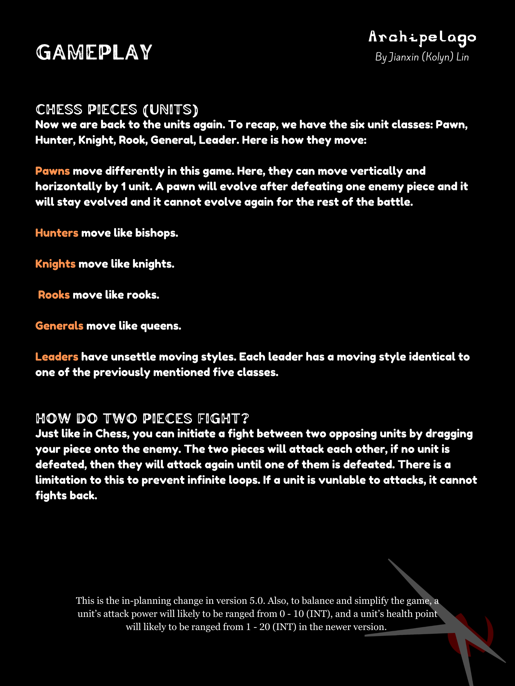
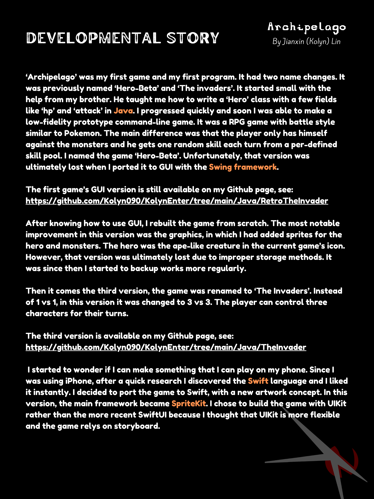
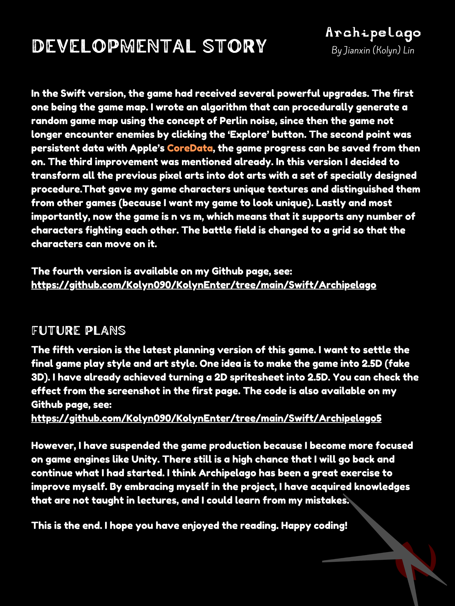

:::warning
I no longer have intention to maintain this project. If you think I might be a good fit on your game dev team, you can contact me at `kolynlin@protonmail.com`. I will be very happy to be invited. 🤗
:::

# Archipelago Origin

The very first version of my game Archipelago 🏝️ This is also my very first game 🕹️

---

# Archipelago Invasion

The first swift 🐧 version of my game Archipelago 🏝️ Dramatically changed game play style 💥
Features:
1.	Made purely with Swift language (SpriteKit & UIKit), originally built with Java.
2.	Support playing style of both landscape and portrait mode on iPhone and iPad
3.	Chess-like unit movement and it is a 1v1 game. (You and my AI, for now...)
4.	Planned to implement luck-based elements
5.	Unlike in Chess, Units have additional space availiability: either melee or ranged
6.	Simple skill systems

Todos:
1.	A cleaner architecture
2.	Lots of testing
3.	More levels
4.	Add shopping scene, characters, items

---

# Archipelago Prequel
The 3rd java version of my game Archipelago 🏝️

---

# Archipelago Hero

Features:
1.	Made purely with Swift language (SpriteKit & UIKit), originally built with Java.
2.	Support playing style of both landscape and portrait mode on iPhone and iPad
3.	Chess-like unit movement and it is a 1v1 game. (You and my AI, for now...)
4.	Planned to implement luck-based elements
5.	Unlike in Chess, Units have additional space availiability: either melee or ranged
6.	Simple skill systems

Todos:
1.	A cleaner architecture
2.	Lots of testing
3.	More levels
4.	Add shopping scene, characters, items

 
 

 
 

 
 

💗 If you liked this blog, consider [following me on GitHub](https://github.com/Kolyn090/).

 
 

👾 Happy Gaming 👾
