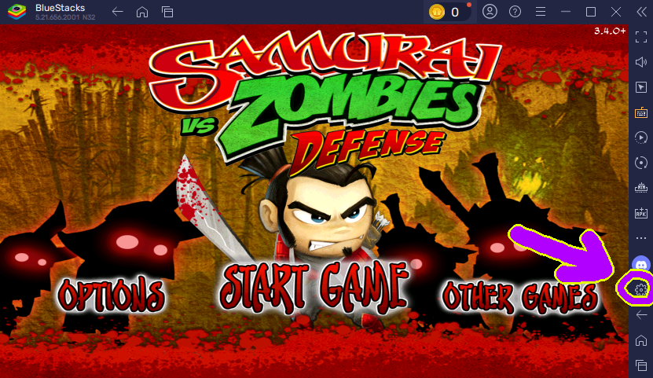
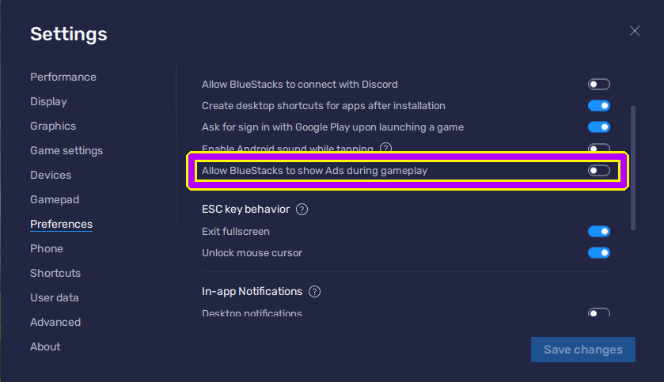
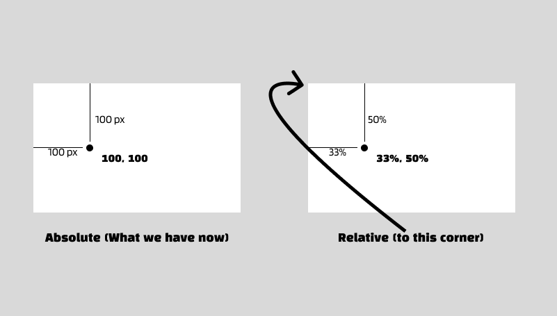

Platform: Windows


Prerequisite: Basic Python

---

## Introduction
Previously I have wrote a very long tutorial on how to play the Pachinko game in Samurai vs Zombies Defense using Machine Learning. From there I introduced to you the basic way to use Python to interact with a BlueStacks emulator (The concept applies to any window). However, the method I introduced has several problems:
1. The way I handled the BlueStacks Ads were COMPLETELY UNNECESSARY, although that could be useful for other types of windows.
2. The window is fixed; once you decided a window size you will have to stick with that.
3. The window cannot be moved.

Therefore, this tutorial will be focusing on solving these problems.


## Solving the first issue
It turns out that BlueStacks provides a native way to hide the ads widget. 

# Step 1️⃣

Locate settings.



# Step 2️⃣

Turn off the ads in preferences.



It's actually possible to achieve our goal with ads turned on, but it makes our lives much easier to do this instead.

:::note[HOORAY]
Wonderful, now we have solved the first problem.
:::

## Solve the rest altogether

The way we handled things were based on absolute potitions, which is the exact source of our problem. Therefore, we need to come up with a new mechanism. 


Instead of using absolute positions, we can use proportions to represent them. But notice that this means that <u>it's based on the assumption that the ratio of window window and height are always the same.</u> This will not work if this ratio is different from the one you set things up, so make sure you keep that in mind! 


To demonstrate



I hope it's straightforward for you to see what we are trying to achieve here now - we need to convert the fixed pixel values to propotions. 


This will involve knowing the absolute position, the current window's width and height, and maybe even its top and left if it's not already in position (0, 0). After you obtained all of those, you would have to wrap your head around the calculations, and you would have to repeat for every single positions! I bet you don't want to face that. That's why I'm going to introduce to you an eaiser approach.

# Step 3️⃣

::github{repo="Kolyn090/KeyTouchArcade"}

First of all, I want you to clone this repository. It's called `KeyTouchArcade`. Although it doesn't sound like it has anything to do with our problems, it indeed contains code that offers great help for us.

After you have cloned the repository, download the requirements through `requirements.txt`.

```cmd
pip install -r requirements.txt
```

# Step 4️⃣

Next, I want you to look for a file called `user-config.toml`. You should see something like this

```toml
[window]
name = "BlueStacks"

# Window will be rescaled to this size after you applied
# the default setup. (px)
default_width = 797
default_height = 481

# Window will be moved to this position after you applied
# the default setup.
# Margined to the top-left corner of the window. (px)
default_top = 0
default_left = 0

# Crop out unwanted regions after rescaling has been applied.
# Adjust this to ensure you have the correct proportion.
# Check the result with screenshot_checker.py (px)
crop_top = 38
crop_left = 0
crop_bottom = 0
crop_right = 0

[system-config]
path = 'system-config.json'

[joystick]
# Controls the angle of turning
# x_factor and y_factor could be useful if you are playing a bird-view game.
x_factor = 1.0
y_factor = 1.0

# The proportion to the position of joystick on the screen
x_proportion = 0.25
y_proportion = 0.75

[gamepad]
# Long-pressing the keys in list will result in continuous clicks
# item: [key, rest-interval]
keep_click_list = [["j", 0.25]]
```

You can modify the values.

1. Modify `window-name` to match your window. 
2. `window-default_width`, `window-default_height`, `window-default_top`, and `window-default_left` are just old stuffs from the past. Not important to modify, but could be potentially useful for debugging.
3. `window-crop_*` remove unnecessary regions. For example, if I didn't hide the ads widget, I could have set `crop_left` to `163` to achieve the same thing.


The rest of the values are for arcade game controls, and you can ignore them.

# Step 5️⃣

The next thing I want you to look at is `mouse_position_recorder.py` under folder `src/identifier`. If you run this script, you should see something like this

```txt
🖱️  Mouse Position Recorder 🖱️

➡️  Hover your mouse over the desired position on the window.
⌨️  Press ANY KEY to record the position.
❌  Press the 'Esc' key to stop recording.
```

Follow the instruction, hover your mouse to a position (and make sure you have the window focused). Press a key on your keyboard (except 'Esc'). You should see something like this now

```txt
Recording {I}: [1481, 578]
```

This means that the program has recorded this key and associated it to where your mouse was. <u>In the end it will automatically calculate and save the proportion.</u>


After you are finished, press 'Esc'. Now you should see a table.


```txt
⚠️ Stopping key 'Key.esc' pressed. ⚠️


Key       | Value
----------|-------------------
i         | CHG: [0.5, 0.87] -> [0.46, 0.26]
q         | NEW: [0.14, 0.52]
o         | UCD: [0.59, 0.87]
j         | UCD: [0.9, 0.85]
Key.space | UCD: [0.94, 0.08]
p         | UCD: [0.5, 0.07]
k         | UCD: [0.77, 0.86]
l         | UCD: [0.81, 0.69]
;         | UCD: [0.9, 0.61]

Press 'Return' to continue. 
```

The keys are just the keys you have pressed. Here I already have included some keys. The values are the `[x_propotion, y_propotion]` we need. 


After you pressed 'Enter', it will ask to you save the changes.


```txt
Do you want to save?[Y/N]
```

I suggest you to save them so that you can retrieve the values later on. The place it stores these info is `system-config.toml`.

# Step 6️⃣

Now that we have the proportions, we still need to convert them back to absolute positions when we are using them. I have wrote this for you as well.


Do it like so

```py
import tomllib
from src.read import read_user_config
from src.util.prop2pos import prop2pos
from src.util.screen_getter import Screen_Getter


with open(read_user_config.file_path, 'rb') as file:
    config = tomllib.load(file)
    config_window = config["window"]

screen_getter = Screen_Getter()
chosen_window = screen_getter.get_window_with_title(config_window["name"])

print(prop2pos(chosen_window, [0.5, 0.5]))
```

You should get the absolute position of the center of your window. Also, you can move the window around and try this code again; you should be expecting the result to be the same (just make sure the entire window is visible on your desktop). You can also change the scale of your window. It should still be pointing to the center.

:::note[HOORAY]
Now that's how we can convert the propotions back to positions.
:::

<br>
<br>

💗 If you liked this blog, consider [following me on GitHub](https://github.com/Kolyn090/).

<br>
<br>

🍯 Happy Coding 🍯
