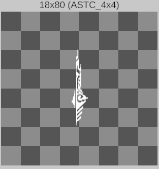

::github{repo="Kolyn090/ASTC2RGBA-Unity"}

Project base on [astc-encoder](https://github.com/ARM-software/astc-encoder). If you use ASTC2RGBA-Unity, please make sure you include the same license in your project, as it is required by the original project.

## Note
You should only consider use this project if you must decode ASTC bytes at runtime (because Unity doesn't expose ASTC decoding at runtime). If you can do this at build time (a.k.a. You have .astc images), I do rather recommend you to load the images in Unity and let it automatically do that for you. 

## How to use
1. Put [astc_decoder.dll](https://github.com/Kolyn090/ASTC2RGBA-Unity/blob/main/Libs/astc_decoder.dll) in ./Assets/Plugins in Unity project.

2. Use `AstcHelper.IsAstcFormat` to confirm your image format is ASTC. 

``` C#
int format = ...;
if (AstcHelper.IsAstcFormat((TextureFormat)format))
{
    ...
}
```

3. Convert the bytes to RGBA format, for example:
``` C#
int width = ...;
int height = ...;
byte[] imageBytes = ...;
byte[] rgbaBytes = new byte[width * height * 4];

(int blockX, int blockY) = GetBlock((TextureFormat)format);
if (blockX == -1)
{
    Debug.LogError($"Unsupported ASTC format: {(TextureFormat)format}");
    return null;
}
try
{
    bool decodeStatus = AstcHelper.DecodeASTC(imageBytes, imageBytes.Length, width, height, rgbaBytes, blockX, blockY);
    if (decodeStatus)
    {
        // Success
        return rgbaBytes;
    }
    else
    {
        Debug.LogError("ASTC decode failed with error code " + decodeStatus);
        return null;
    }
}
catch
{
    Debug.LogError("Failed to decode ASTC to RGBA. DLL could be incompatible.");
    return null;
}
```

4. To render the bytes as Texture2D, for example:
``` C#
Texture2D texture = new(width, height, TextureFormat.RGBA32, false);
texture.LoadRawTextureData(rgbaBytes);
texture.filterMode = FilterMode.Point;
texture.Apply();
```

The following is an example:



<br>
<br>

💗 If you liked this blog, consider [following me on GitHub](https://github.com/Kolyn090/).

<br>
<br>

🍯 Happy Coding 🍯
